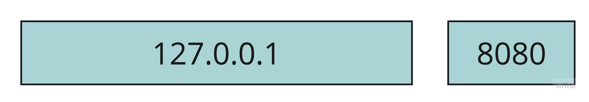
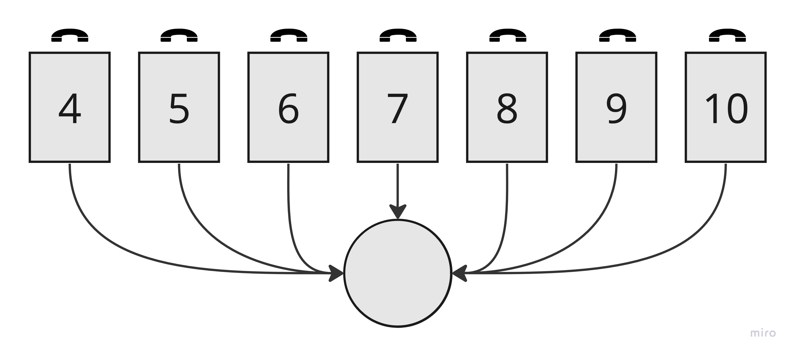
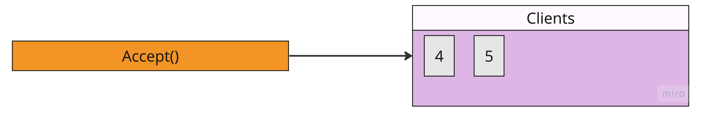
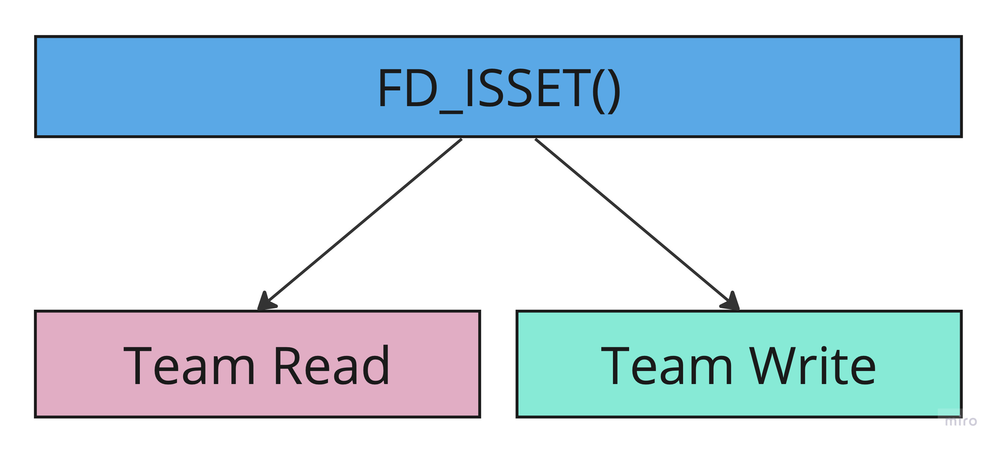
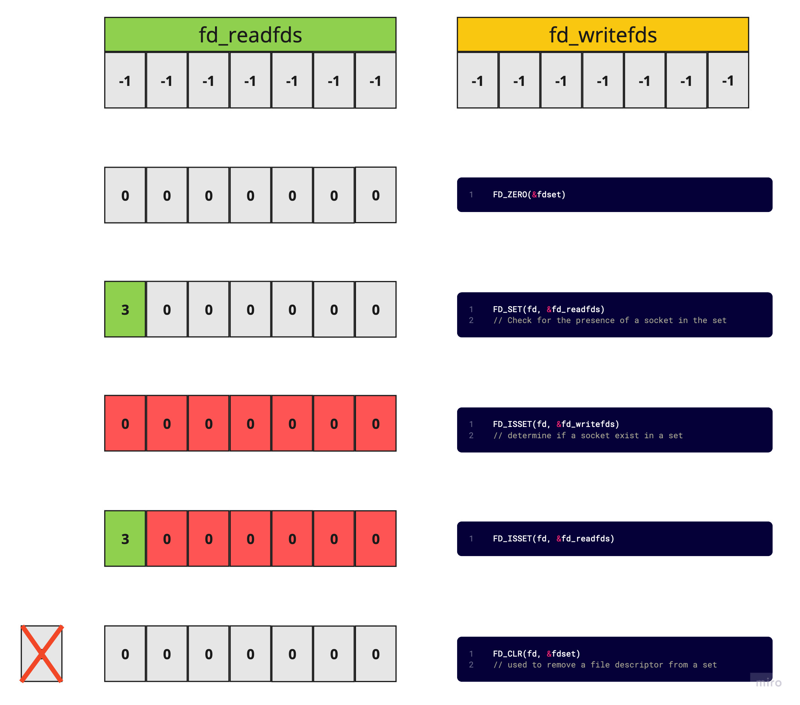
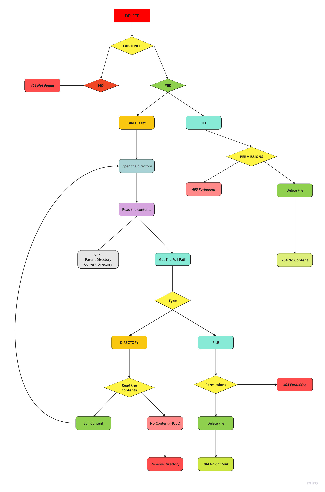
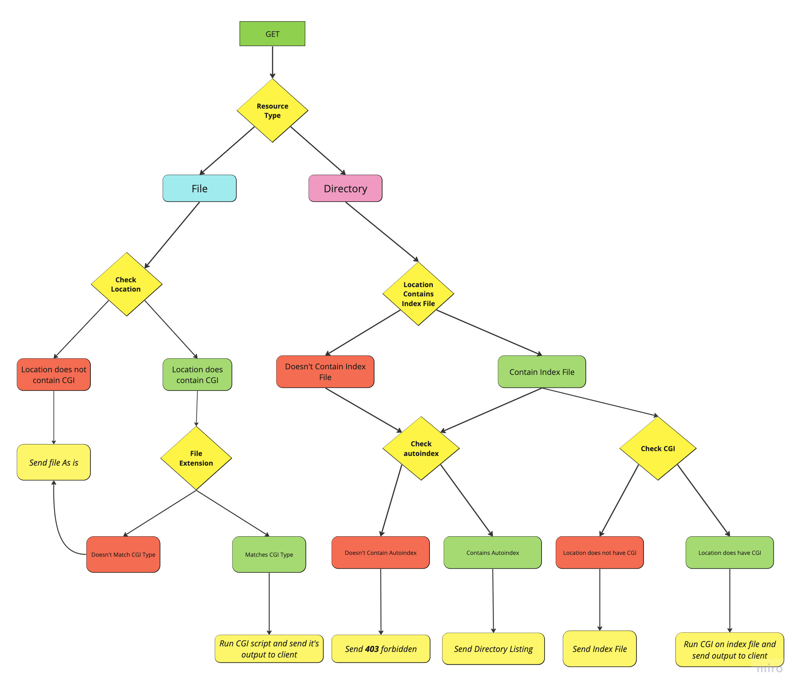
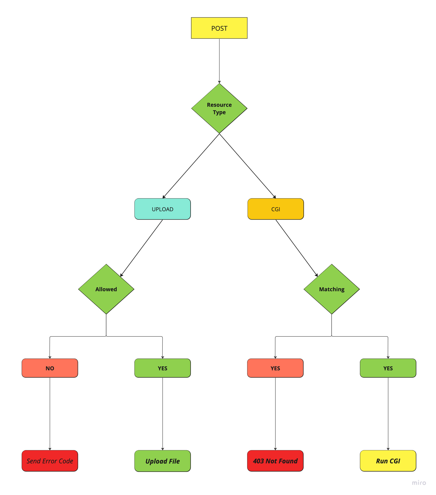

# Webserv

Explaining how a web server works using a call center analogy

* Imagine the server as a call center where clients can call in and request information or resources

<p align="center">


* Setting up  for example a phone line for the call center. The server creates a socket to listen for incoming connections from clients.

<p align="center">


* Assigning a phone number to the call center's phone line. The server binds the socket to a specific IP address and port number so that clients can connect to it

<p align="center">


* Start listening for incoming connections it's like having the phone line open and available for incoming calls so the server listens for incoming connections from clients on the server socket, Now we do have multiple phone lines available for incoming calls the server creates an array of sockets ```fd_set``` to manage incoming connections from clients

<p align="center">



* Using the ```select``` function to monitor sockets this is like having a team of operators at the call center who can monitor incoming calls on multiple phone lines simultaneously.The server uses the select function to monitor the array of sockets ```fd_set```  and check for incoming connections or data from clients

<p align="center">


* Accepting incoming connections and adding them to an array of connected clients () so when a client connects to the server, the server accepts the connection and adds the client to an array of connected clients so that they are ready for I/O operations.

<p align="center">


*  Using ```FD_ISSET``` to check which sockets have incoming data or connections waiting this is like having the operators at the call center use a caller ID system to see which callers are waiting on hold or have requested a callback, he server divides the handling of incoming data into two teams one for reading data from clients (incoming requests) and one for writing data to clients (sending responses).

<p align="center">



*********


Here's the macros used in combination with the select function to monitor one or more file descriptors for I/O

<p align="center">



## DELETE Method Implementation :

Implemented and explained by [TouFa7](https://github.com/toufa7)


<p align="center">



    int stat (const char *filename, struct stat *buf);
    
    struct stat {
        st_mode; // S_ISREG, S_ISDIR 
        {
            // File Permissions
            // {
                    // S_IRUSR : Read
                    // S_IWUSR : Write
                    // S_IXUSR : Execute
            // }
            
        }
        st_size; // File size in bytes
    }
    
https://www.mkssoftware.com/docs/man5/struct_stat.5.asp


    struct dirent *readdir(DIR *);
    struct dirent {
        d_type; // Type of file (DT_REG, DT_DIR)
        d_name[256]; // Filename
    }

https://stackoverflow.com/questions/12991334/members-of-dirent-structure

https://www.gnu.org/software/libc/manual/html_node/Directory-Entries.html


## GET Method Implementation :

Implemented and explained by [Ibranad](https://github.com/ibranad)

<p align="center">



## POST Method Implementation :

Implemented and explained by [Abouchfa](https://github.com/Abdeljalil-Bouchfar)

<p align="center">



# Resources

https://www.gta.ufrj.br/ensino/eel878/sockets/index.html

https://ipwithease.com/what-is-a-websocket/

https://stackoverflow.com/questions/6729366/what-is-the-difference-between-af-inet-and-pf-inet-in-socket-programming

https://stackoverflow.com/questions/76412255/how-to-fix-error-141-when-using-select-and-send-in-c-web-server-for-multip/76413445

https://stackoverflow.com/questions/5815675/what-is-sock-dgram-and-sock-stream


## TIPS:

if you want to look for a manuel of any function use this website mkssoftware/qnx (eg: mkssoftware select)
